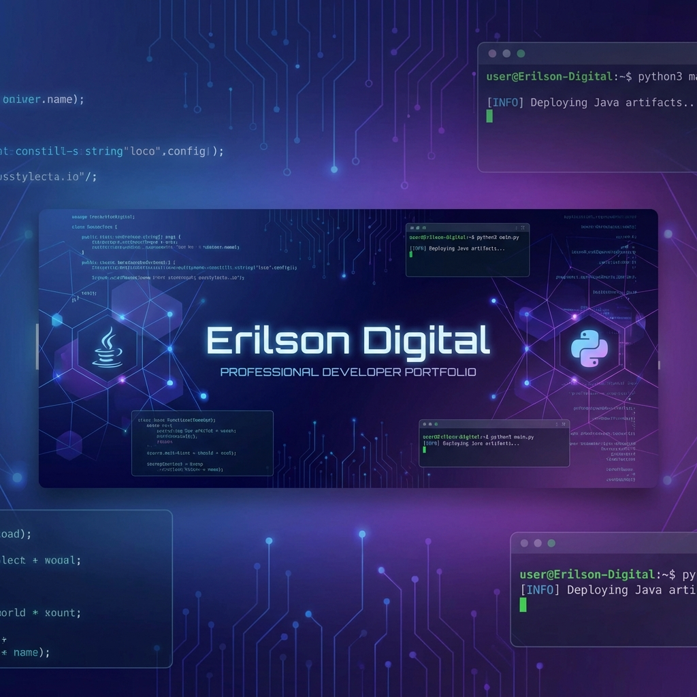

<div align="center">



# 👨‍💻 Erilson Digital | Full-Stack Developer

[](https://erilsondigital.com)
[](https://www.linkedin.com/in/jose-erilson-araujo-3265a52b1/)
[](https://discord.gg/3VDFU2wy)
[](https://instagram.com/josearaujo1986)
[](mailto:joseerilsonaraujo@gmail.com)
[](https://wa.me/5584994349355)

**Transformando ideias em software seguro e escalável**

[📅 Agendar Consultoria](https://calendly.com/joseerilsonaraujo/30min) • [💼 Ver Portfólio](#-projetos-destaque) • [🚀 Tecnologias](#-stack-tecnológico)

</div>

---

## 🎯 Sobre Mim

Desenvolvedor Full-Stack especializado em **Java** e **Python**, com formação única em **Direito** que me permite pensar em riscos, contratos e garantias ao desenvolver software. Não sou apenas um programador - sou um **parceiro de negócios** que entende tanto de código quanto de estratégia empresarial.

### 💡 Diferenciais

- 🎓 **Formação Híbrida**: Direito + Tecnologia = Visão 360° do negócio
- 🛡️ **Segurança First**: Código blindado contra vulnerabilidades
- 📈 **Foco em ROI**: Tecnologia que escala e gera receita
- 🏗️ **Arquitetura de Elite**: Clean Architecture, SOLID, Design Patterns
- 🤝 **Compromisso Absoluto**: Não entrego nada que eu não usaria na minha própria empresa

---

## 🚀 Stack Tecnológico

### Backend & APIs


### Frontend & Mobile


### DevOps & Cloud


### AI & Automation


---

## 💼 Projetos Destaque

### 🏦 Sistema Bancário Completo
**Tecnologias**: Java, Spring Boot, PostgreSQL, React  
**Descrição**: Plataforma bancária full-stack com autenticação JWT, transações seguras, e dashboard administrativo.  
**Destaques**:
- ✅ Arquitetura em camadas (Clean Architecture)
- ✅ Testes unitários e de integração
- ✅ API RESTful documentada com Swagger
- ✅ Sistema de auditoria completo

### 🤖 Sofia - Assistente Executiva IA
**Tecnologias**: React, TypeScript, Gemini AI, Tailwind CSS  
**Descrição**: Assistente virtual inteligente integrada ao portfólio para qualificação de leads.  
**Destaques**:
- ✅ Integração com Google Gemini 2.0
- ✅ Detecção de intenções (agendamento, orçamento, etc.)
- ✅ Interface conversacional moderna
- ✅ Sistema de sugestões contextuais

### 📱 App Mobile de Gestão
**Tecnologias**: React Native, Python (Backend), MongoDB  
**Descrição**: Aplicativo mobile para gestão de tarefas e projetos com sincronização em tempo real.  
**Destaques**:
- ✅ Offline-first architecture
- ✅ Push notifications
- ✅ Sincronização automática
- ✅ Interface intuitiva e responsiva

### 🌐 ErilsonDigital Portfolio
**Tecnologias**: React, TypeScript, Next.js, Tailwind CSS  
**Descrição**: Portfólio profissional moderno com sistema de agendamento integrado.  
**Destaques**:
- ✅ Design glassmorphism premium
- ✅ Sistema de agendamento via Calendly
- ✅ Multilíngue (PT, EN, ES)
- ✅ Dark mode e animações suaves
- ✅ SEO otimizado

---

## 📊 Estatísticas GitHub

<div align="center">


</div>

---

## 🎓 Formação & Certificações

### 🎓 Educação
- **Bacharelado em Direito** - Visão estratégica e análise de riscos
- **Tecnologia da Informação** - Desenvolvimento Full-Stack

### 📜 Certificações
- ☕ Java Spring Boot Specialist
- 🐍 Python Advanced Developer
- ☁️ AWS Cloud Practitioner
- 🔒 Cybersecurity Fundamentals

---

## 🏆 Metodologia de Trabalho

### 🔄 Fluxo de Desenvolvimento

```
📋 Análise de Requisitos
    ↓
🏗️ Arquitetura & Design
    ↓
⚡ Desenvolvimento Ágil
    ↓
🧪 Testes Automatizados
    ↓
👀 Code Review
    ↓
🚀 Deploy Contínuo
    ↓
📊 Monitoramento
    ↓
🛠️ Suporte & Manutenção
```

### 🎯 Princípios
- **Clean Code**: Código legível e manutenível
- **SOLID**: Princípios de design orientado a objetos
- **DRY**: Don't Repeat Yourself
- **TDD**: Test-Driven Development quando aplicável
- **CI/CD**: Integração e deploy contínuos

---

## 📈 Serviços Oferecidos

| Serviço | Descrição | Tecnologias |
|---------|-----------|-------------|
| 🌐 **Desenvolvimento Web** | Sites e aplicações web modernas e responsivas | React, Next.js, TypeScript |
| 📱 **Apps Mobile** | Aplicativos nativos e híbridos | React Native, Flutter |
| ⚙️ **APIs & Backend** | APIs RESTful robustas e escaláveis | Java Spring Boot, Python FastAPI |
| 🤖 **Automação** | Scripts e bots para otimização de processos | Python, Selenium |
| 🔐 **Segurança** | Auditoria e implementação de boas práticas | OWASP, JWT, OAuth |
| ☁️ **Cloud & DevOps** | Deploy, CI/CD e infraestrutura | AWS, Docker, GitHub Actions |
| 🎨 **UI/UX Design** | Interfaces modernas e intuitivas | Figma, Tailwind CSS |
| 🧠 **Integração IA** | Chatbots e assistentes inteligentes | Gemini AI, OpenAI |

---

## 📞 Vamos Construir Algo Incrível?

Estou sempre aberto a novos desafios e oportunidades de colaboração. Se você tem um projeto em mente ou precisa de um desenvolvedor comprometido com excelência, vamos conversar!

<div align="center">

### 🚀 Formas de Contato

[](https://calendly.com/joseerilsonaraujo/30min)

[](mailto:joseerilsonaraujo@gmail.com)

[_99434--9355-25d366?style=for-the-badge&logo=whatsapp&logoColor=white)](https://wa.me/5584994349355)

[](https://www.linkedin.com/in/jose-erilson-araujo-3265a52b1/)

[](https://discord.gg/3VDFU2wy)

[](https://instagram.com/josearaujo1986)

[](https://erilsondigital.com)

</div>

---

## 📄 Sobre Este Projeto

Este portfólio foi desenvolvido com as seguintes tecnologias:

- ⚛️ **React 19** com TypeScript
- ⚡ **Next.js 14** (App Router)
- 🎨 **Tailwind CSS** para estilização
- 🤖 **Google Gemini AI** para assistente virtual
- 📅 **Sistema de Agendamento Próprio** (Google Calendar Style)
- 🌐 **Multilíngue** (Português, Inglês, Espanhol)

### 🚀 Como Rodar Localmente

```bash
# Clone o repositório
git clone https://github.com/erilsonaraujo/ErilsonDigital.git

# Entre na pasta
cd ErilsonDigital

# Instale as dependências
npm install

# Configure as variáveis de ambiente
# Crie um arquivo .env com:
# VITE_GEMINI_API_KEY=sua_chave_aqui

# Rode o projeto
npm run dev

# Build para produção
npm run build
```

---

<div align="center">

### ⭐ Se este projeto te inspirou, deixe uma estrela!

**Desenvolvido com 💙 por Erilson Digital**

© 2025 Erilson Digital. Todos os direitos reservados.

</div>
